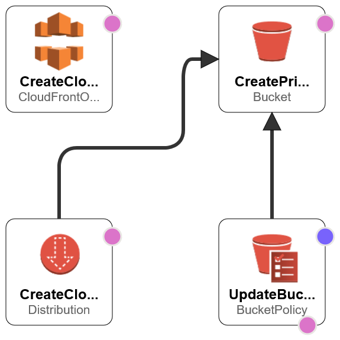

# CreateCloudFrontS3Origin.yaml
Deploys a CloudFront distribution which uses Origin Access Identity to access content within a Private S3 Bucket.

## About
This template deploys a CloudFront distribution and an S3 Bucket. The S3 bucket is configured to prevent public access and a bucket policy is added to grant CloudFront OAI access to read files from the bucket. The goal here is to prevent an end-user from accessing the content within the S3 Bucket directly, and instead make them navigate to the CloudFront distribution. Per Amazon's [documentation](https://docs.aws.amazon.com/AmazonCloudFront/latest/DeveloperGuide/private-content-restricting-access-to-s3.html):

> If you use CloudFront signed URLs or signed cookies to restrict access to files in your Amazon S3 bucket, you probably also want to prevent users from accessing your Amazon S3 files by using Amazon S3 URLs. If users access your files directly in Amazon S3, they bypass the controls provided by CloudFront signed URLs or signed cookies. This includes control over the date and time that a user can no longer access your content, and control over which IP addresses can be used to access content. In addition, if users access files both through CloudFront and directly by using Amazon S3 URLs, CloudFront access logs are less useful because they're incomplete.

At the moment, this template is pretty basic. That is mainly because CloudFront isn't something that I have a ton of experience in. Going forward, I'd like to expand on this template to have it handle an S3 Website and add some security controls, as described in the quoted text above.

## Deployment Instructions
This CloudFormation template has no prerequisites. This file can be deployed within **CloudFormation**.

## Notes
Once the CloudFormation template successfully deploys, you can upload a file to the S3 Bucket listed in the outputs section of the CloudFormation Template. When that is complete, you can navigate to the CloudFront Distribution that is also listed in the Outputs section and access the file (you will need to prepend https:// to the value and append /filename.extention. For example: https://d478ga14rb0ev.cloudfront.net/image.png)

## Deployment Diagram
