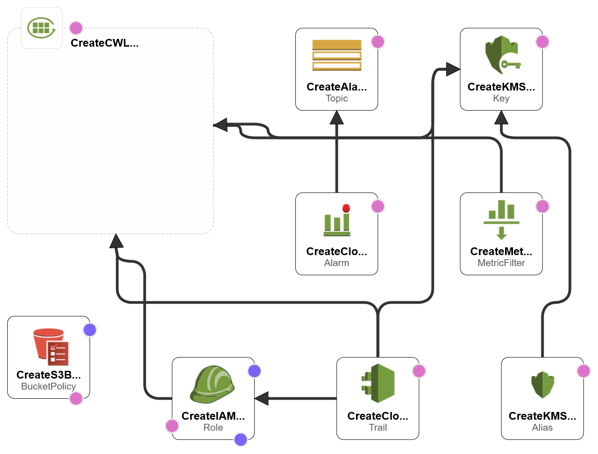

# CreateCloudWatchNotification.yaml
Deploys the resources required to monitor logins via the AWS Console within an account and sends a notification via SNS to a specified e-mail address when a specific IAM user logs in.

## About
This template deploys a series a resources which work together to monitor and alert someone (via e-mail) when a specific IAM user logs in. Although the file could be a standalone deployment, I wrote it to re-use the exported S3 Bucket from the [CreateLabNetwork.yaml](../aws-create-lab-network/CreateLabNetwork.yaml) file to get a bit more familiar with using [ImportValue](https://docs.aws.amazon.com/AWSCloudFormation/latest/UserGuide/intrinsic-function-reference-importvalue.html) which I haven't used too much previously.

To make this more useful, I would have liked to have it monitor for logins from **Root**, however the provider that I'm using to build and test these templates has specific limitations in place that prevent certain Roles and Services from being used, one of which is accessing the account as Root.

## Deployment Instructions
This CloudFormation template has the following prerequisites:
* Create an EC2 Keypair (required for [CreateLabNetwork.yaml](../aws-create-lab-network/CreateLabNetwork.yaml))
* Deploy the [CreateLabNetwork.yaml](../aws-create-lab-network/CreateLabNetwork.yaml)
* Have an e-mail address ready in order to receive notifications (I was able to use this with an e-mail generated from [10minutemail](https://10minutemail.com/))

Once all prerequisites are met, this file can be deployed within **CloudFormation**.

## Notes
Once the CloudFormation template successfully deploys, check your e-mail for an SNS subscription confirmation e-mail. You will want to confirm your e-mail **before** logging in as the User who will trigger the CloudWatch Alarm.

## Deployment Diagram
