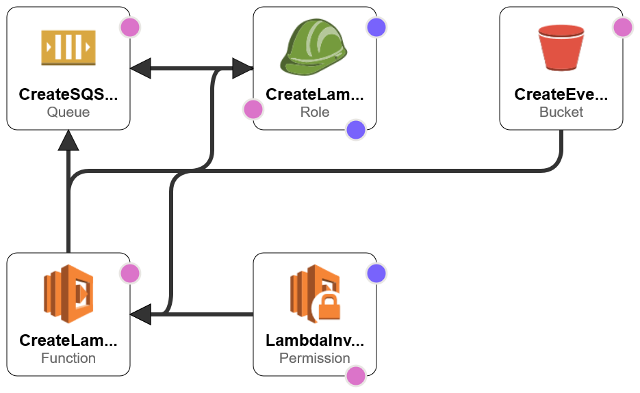

# CreateCloudFrontS3Origin.yaml
Deploys an S3 Bucket which triggers a Lambda when files are uploaded. The Lambda function processes the file and sends a message to an SQS queue.

## About
This CloudFormation template deploys an S3 bucket, a Lambda function, and an SQS Queue. The S3 bucket is configured to send events to the Lambda function whenever an object is created. When the Lambda receives the event, it parses the data within the event and sends it over to the SQS queue. Since the Lambda code required to make this work was overall pretty short, I opted to use an "inline" method vs. using a .zip file uploaded to an S3 bucket.

## Deployment Instructions
This CloudFormation template has no prerequisites. This file can be deployed within **CloudFormation**.

## Notes
Once the CloudFormation template successfully deploys, you can upload a file to the S3 Bucket listed in the outputs section of the CloudFormation Template. Once uploaded, you can navigate to the SQS queue that was created, select **Send and receive messages** and then select **Poll for messages**. Upon doing so, you should see a message arrive. If not, give it a few moments and try again. If nothing shows up, you should be able to find an error message in the CloudWatch logs associated with the Lambda function.

## Deployment Diagram
