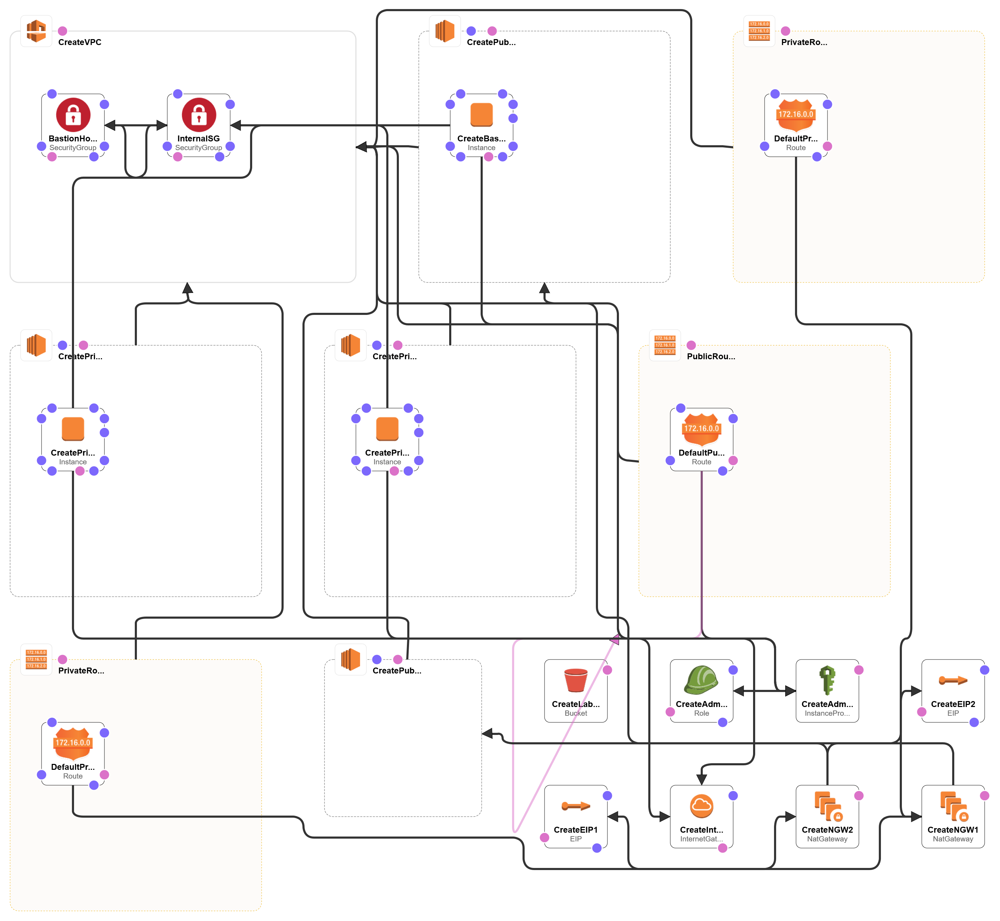

# CreateLabNetwork.yaml
Creates a baseline underlying network including a Vpc, Public and Private Subnets, a Bastion Host, Internet and NAT gateways, and more.

## About
> :warning: This CFT deploys an IAM role with Administrator Permissions and attaches it's Instance Profile to multiple EC2 instances

This file deploys a simple AWS Network that will be used as the baseline environment for this lab. In *some* cases, this file will be a prerequisite to the successful deployment of other files, either due to **CloudFormation Exports** or simply because the resources created within are the building-blocks for another resource.

## Deployment Instructions
This CloudFormation template has the following prerequisites:
* Create an EC2 Keypair

Once all prerequisites are met, this file can be deployed within **CloudFormation**.

## Deployment Diagram
