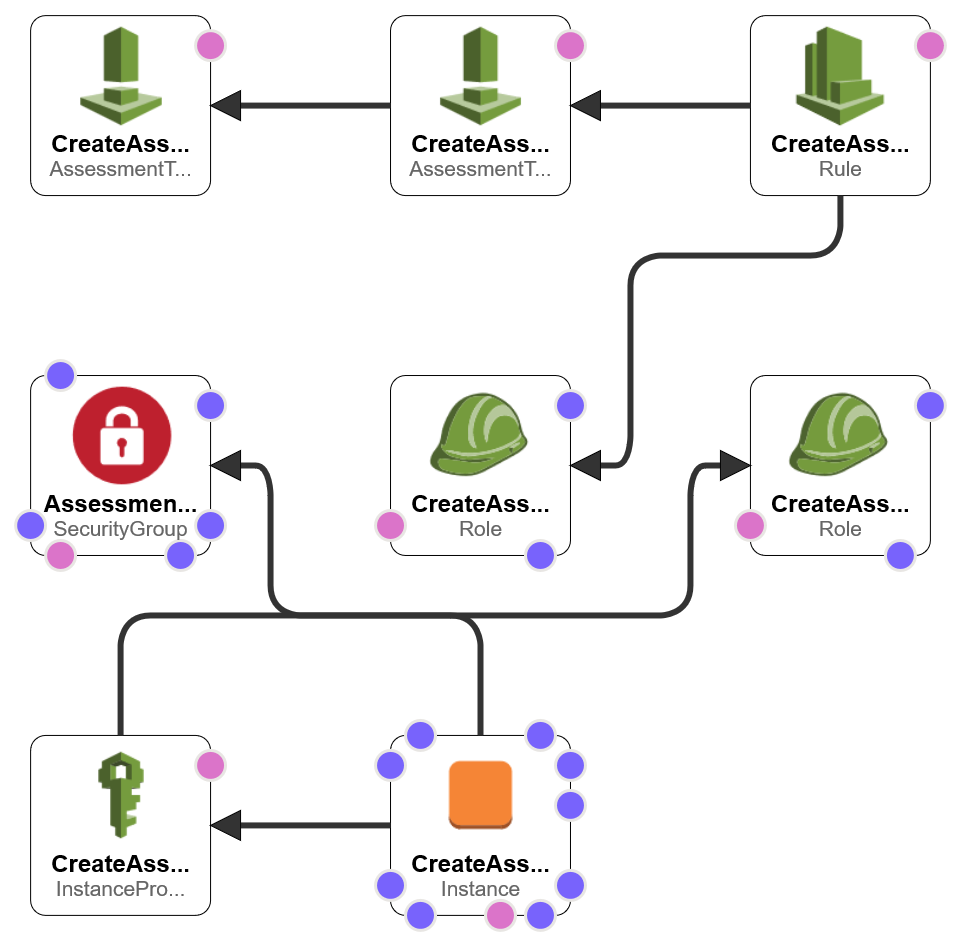

# CreateScheduledAssessment.yaml
Deploys Amazon Inspector Classic and configures a scheduled event to trigger an assessment. Optionally, deploys an EC2 instance and installs the Amazon Inspector agent.

## About
This template deploys the resources needed to run Amazon Inspector Classic and configures a CloudWatch Event (EventBridge) rule that runs on an hourly schedule to re-assess the resources. Additionally, as an optional setting, the CloudFormation template can be set to deploy an EC2 instance that installs the Amazon Inspector agent using commands executed within the UserData section. If selected an IAM Role, Instance Profile, and EC2 instance will be deployed in addition to the resources already described. This does use one of the Subnets exported from the [CreateLabNetwork.yaml](../aws-create-lab-network/CreateLabNetwork.yaml), so that will need to be ran first. This template does not deploy the EC2 instance with an EC2 KeyPair. Instead, the instance profile attached to the EC2 instance provides permissions to access the instance using Session Manager.

## Deployment Instructions
This CloudFormation template has the following prerequisites:
* Deploy the [CreateLabNetwork.yaml](../aws-create-lab-network/CreateLabNetwork.yaml)
* Decide if you want to use an existing EC2 instance that already has the Agent installed, if you prefer to manually install the agent yourself, or if you want to have the CloudFormation template deploy it for you.

Once all prerequisites are met, this file can be deployed within **CloudFormation**.

## Deployment Diagram
