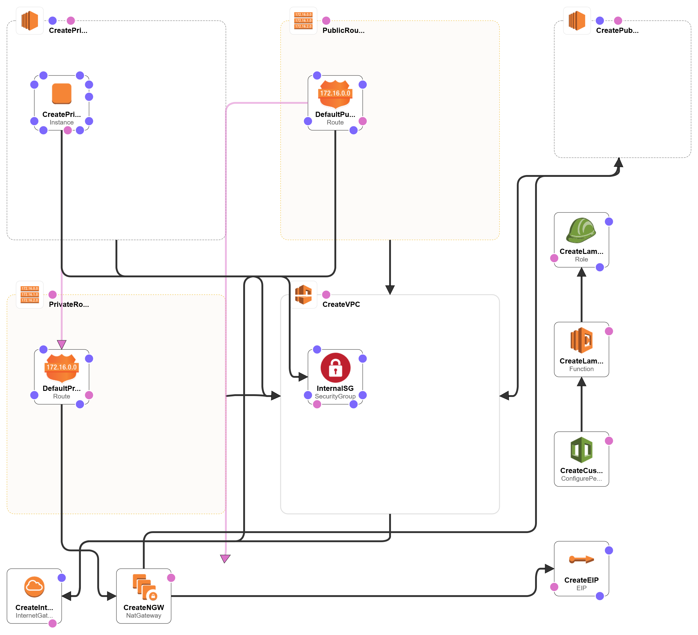

# CreateVpcPeering.yaml
Creates a new network including a Vpc, Public and Private Subnets, Internet and NAT gateways, a CloudFormation "Custom Resource" Lambda function and more. Configures VPC Peering between the Vpc created in this template and the existing VPC in the same account created by the [CreateLabNetwork.yaml](/aws-personal-lab/aws-create-lab-network/CreateLabNetwork.yaml) file.

## About

This file expands on the simple AWS Network that deployed within the **CreateLabNetwork.yaml** file, by incorporating Vpc Peering. This is handled through a Lambda function that communicates with the CloudFormation template through the use of [Custom Resources](https://docs.aws.amazon.com/AWSCloudFormation/latest/UserGuide/template-custom-resources.html).

## Deployment Instructions
This CloudFormation template has the following pre-requisites:
* Deploy the [CreateLabNetwork.yaml](/aws-personal-lab/aws-create-lab-network/CreateLabNetwork.yaml)
* Create an EC2 Keypair (Can reuse the same keypair required for [CreateLabNetwork.yaml](/aws-personal-lab/aws-create-lab-network/CreateLabNetwork.yaml))
* Create **lambda_function.zip** using the contents of the [lambda](./lambda/) directory within this section
* Upload the .zip file to an S3 bucket that has versioning enabled
    * An S3 bucket that fits this requirement is created automatically as part of [CreateLabNetwork.yaml](/aws-personal-lab/aws-create-lab-network/CreateLabNetwork.yaml)

Once all pre-requisites are met, this file can be deployed within **CloudFormation**.

## Notes
While I've made attempts to handle errors within the Lambda function, situations within the AWS environment may arrise that cause the function to fail. If that happens during the deployment or deletion of the CloudFormation template, it may result in the action hanging (I've seen it take over 1 hour and 30 minutes before).

If this does occur, you can get around this by manually triggering a response to the CloudFormation stack following the instructions found [here](https://aws.amazon.com/premiumsupport/knowledge-center/cloudformation-lambda-resource-delete/). You will be able to use the event that appears in the output of the CloudWatch Log associated with the Lambda function to populate the required values of the command.

## Deployment Diagram
